# Scraplan - Scrap collection management platform

<div align="center">
  <h3>Nền tàng quản lý và thu gom phế liệu cho chuỗi cửa hàng</h3>
  
  [](https://nextjs.org/)
  [](https://nestjs.com/)
  [](https://www.postgresql.org/)
  [](https://www.docker.com/)
</div>

## Giới thiệu

**Scraplan** là một nền tảng quản lý chất thải thông minh, kết nối các cửa hàng thu gom phế liệu với mạng lưới tài xế đáng tin cậy. Hệ thống giúp tối ưu hóa quy trình thu gom, cung cấp giá cả minh bạch và theo dõi real-time.

# Sử dụng

### Truy cập ứng dụng
- Tài khoản demo phía cuối readme
- **Home**: https://f8-final-project.vercel.app
- **Driver**: https://f8-final-project.vercel.app/login
- **Store**: https://f8-final-project.vercel.app/store-login
- **Vendor/Admin**: https://f8-final-project.vercel.app/vendor-login

## Screenshot & Demo

### Driver
- Tài xế được hiển thị đơn hàng của cửa hàng cách vị trí 5km

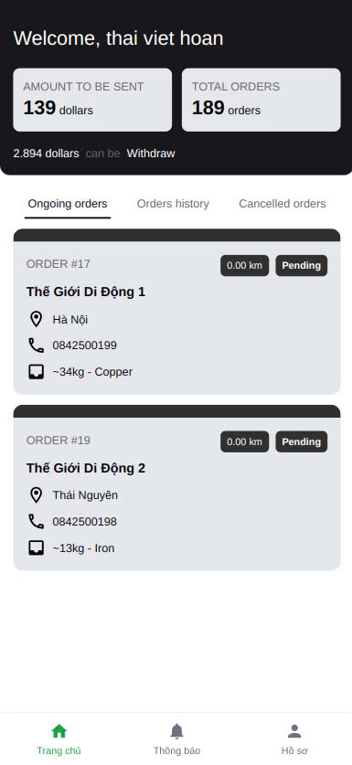

- Tài xế nhận đơn và cập nhật trạng thái đơn

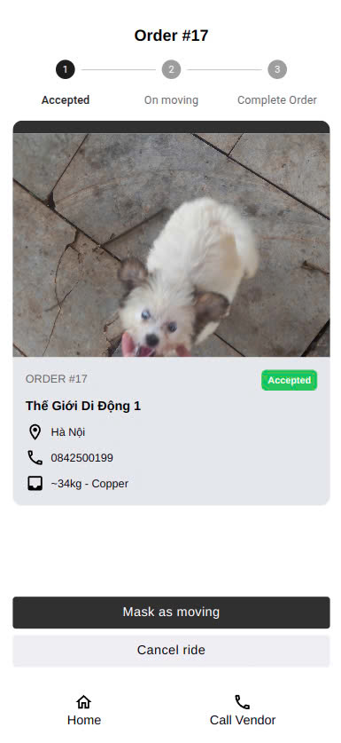

- Tài xế giao hàng xong cần thanh toán

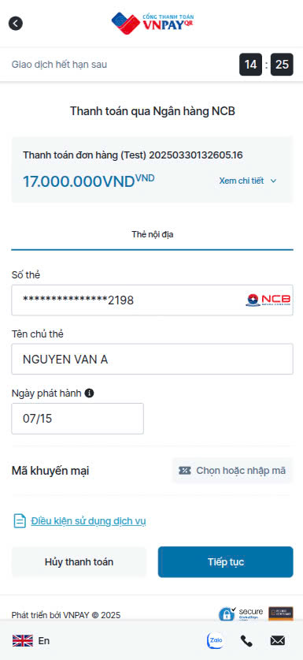

- Nếu không sẽ không được nhận đơn hàng mới. Thanh toán chậm 12h sẽ bị khóa tài khoản

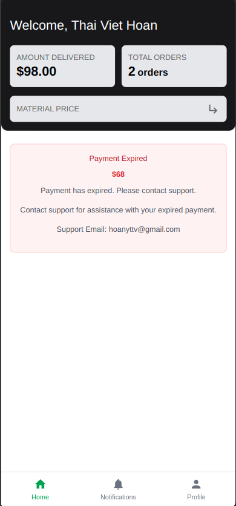

### Vendor
- Quản lý cửa hàng dưới quyền mình. Thống kê doanh thu. Các đơn hàng của các cửa hàng
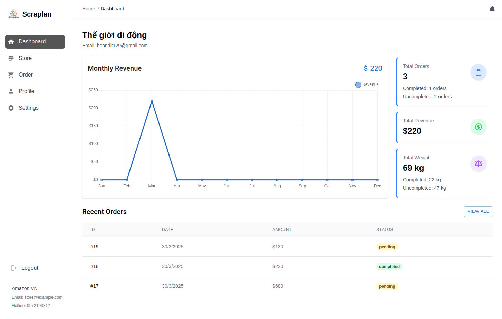

### Store
- Cửa hàng quản lý đơn hàng của mình, thống kê doanh thu
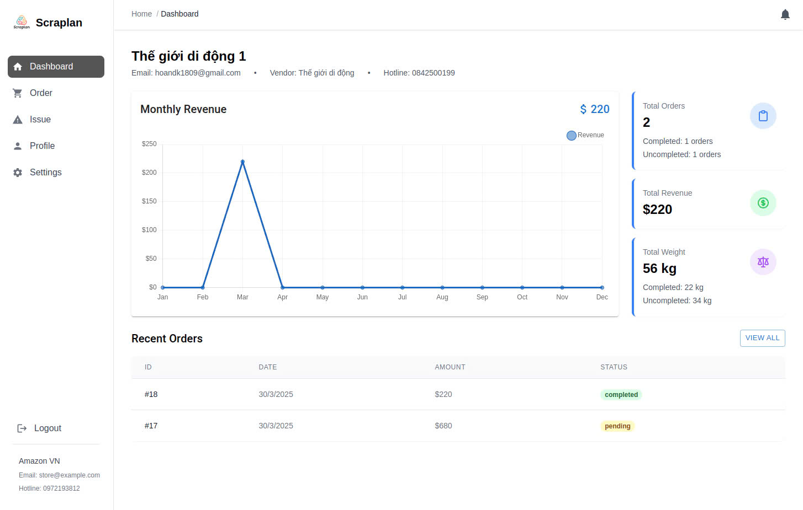

- Cửa hàng tạo đơn hàng
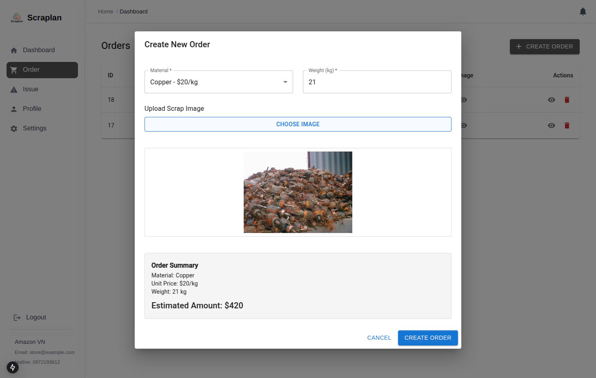

- Cửa hàng có thể khiếu nại về đơn hàng
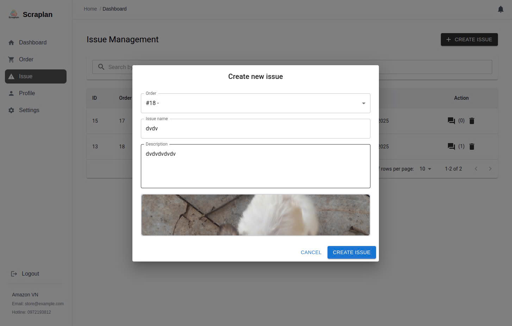

- Cửa hàng nhắn tin với admin qua khiếu nại được tạo
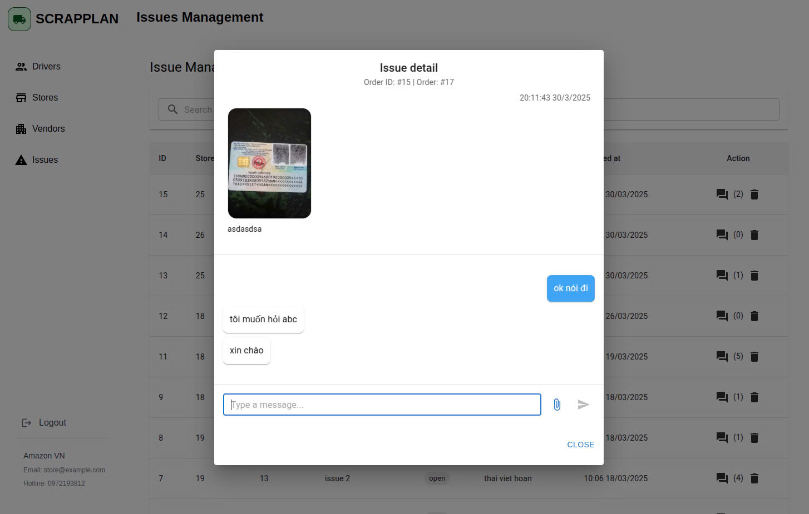

### Admin
- Quản lý thông tin driver, vender, store, issue, material. Duyệt các thông tin giấy tờ.
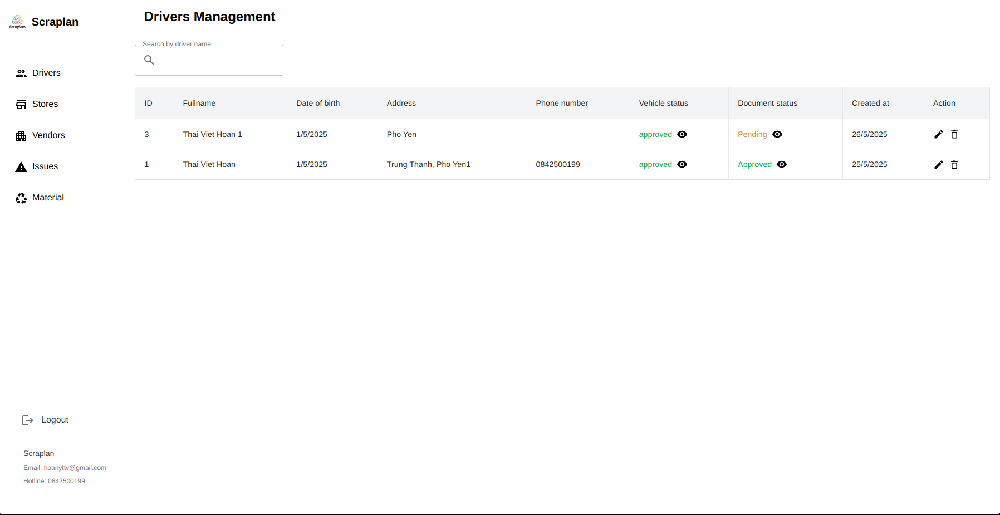
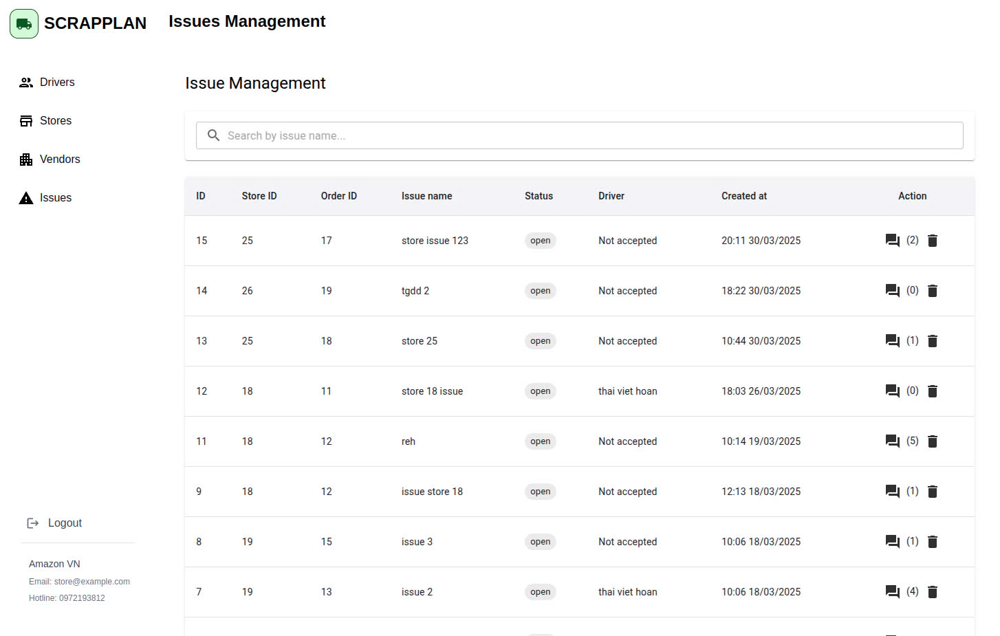


##  Tính năng chính

###  Dành cho Cửa hàng (Store)
- **Đặt đơn hàng** thu gom phế liệu
- **Theo dõi real-time** trạng thái đơn hàng
- **Quản lý thanh toán** với VNPay integration
- **Báo cáo thống kê** doanh thu và lợi nhuận
- **Khiếu nại về đơn hàng**

###  Dành cho Tài xế (Driver)
- **Nhận đơn hàng** từ hệ thống, quét những đơn hàng từ cửa hàng gần vị trí
- **Navigation GPS** tích hợp
- **Cập nhật trạng thái** đơn hàng real-time
- **Quản lý thu nhập** và thống kê
- **Thông báo thanh toán** chưa hoàn thành
- **Không thể nhận đơn mới khi** chưa hoàn thành hoặc thanh toán trễ

###  Dành cho Nhà cung cấp (Vendor)
- **Quản lý cửa hàng** dưới quyền
- **Theo dõi đơn hàng** toàn bộ cửa hàng dưới quyền
- **Báo cáo tài chính** chi tiết
- **Dashboard analytics** tổng quan

###  Dành cho Admin
- **Quản lý toàn hệ thống** users và roles
- **Kiểm duyệt tài liệu** xác thực
- **Quản lý materials** và pricing
- **Thống kê tổng quan** platform
- **Xử lý khiếu nại** và support

##  Công nghệ sử dụng

### Frontend
- **Next.js 15.0.3** - React framework với App Router
- **TypeScript** - Type safety và developer experience
- **Tailwind CSS** - Utility-first CSS framework
- **Material-UI** - Component library
- **Redux Toolkit** - State management
- **React Hook Form** - Form handling
- **Axios** - HTTP client

### Backend
- **NestJS** - Progressive Node.js framework
- **TypeScript** - Backend type safety
- **PostgreSQL** - Primary database
- **TypeORM** - Database ORM
- **JWT** - Authentication & authorization
- **Passport.js** - Authentication strategies
- **Swagger** - API documentation

### DevOps & Deployment
- **Docker** - Containerization
- **Docker Compose** - Multi-container orchestration
- **Vercel** - Frontend deployment
- **Render.com** - Backend deployment
- **Neon.tech** - PostgreSQL hosting

### Payment & Integration
- **VNPay** - Payment gateway
- **Nodemailer** - Email service
- **Multer** - File upload handling

## Sử dụng

### Truy cập ứng dụng
- **Home**: https://f8-final-project.vercel.app
- **Driver**: https://f8-final-project.vercel.app/login
- **Store**: https://f8-final-project.vercel.app/store-login
- **Vendor/Admin**: https://f8-final-project.vercel.app/vendor-login

### Tài khoản demo
```
Admin:
- Email: hoankk1809@gmail.com
- Password: Shinki_1809

Vendor:
- Email: hoandk1805@gmail.com
- Password: Shinki_1809

Store:
- Email: hoandk189@gmail.com
- Password: Shinki_1809

Driver:
- Email: hoanythien@gmail.com
- Password: Shinki_1809
```

### Quy trình sử dụng cơ bản

1. **Đăng ký tài khoản** theo role phù hợp
2. **Xác thực email** và hoàn thiện profile
4. **Vendor**: Xác nhận store
3. **Store**: Tạo đơn hàng thu gom
5. **Driver**: Nhận và thực hiện đơn hàng
6. **Thanh toán** qua VNPay
7. **Hoàn thành**
