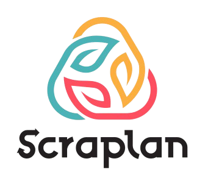

# 🌱 Scraplan - Smart Waste Management Platform

<div align="center">
  
  
  **Maximize your scrap profits with smart waste management**
  
  [](https://nextjs.org/)
  [](https://www.typescriptlang.org/)
  [](https://nestjs.com/)
  [](https://www.postgresql.org/)
  [](https://www.docker.com/)
</div>

## 📋 Mục lục

- [Giới thiệu](#-giới-thiệu)
- [Tính năng chính](#-tính-năng-chính)
- [Công nghệ sử dụng](#-công-nghệ-sử-dụng)
- [Kiến trúc hệ thống](#-kiến-trúc-hệ-thống)
- [Cài đặt](#-cài-đặt)
- [Sử dụng](#-sử-dụng)
- [API Documentation](#-api-documentation)
- [Screenshots](#-screenshots)
- [Đóng góp](#-đóng-góp)
- [Liên hệ](#-liên-hệ)

## 🌟 Giới thiệu

**Scraplan** là một nền tảng quản lý chất thải thông minh, kết nối các cửa hàng thu gom phế liệu với mạng lưới tài xế đáng tin cậy. Hệ thống giúp tối ưu hóa quy trình thu gom, cung cấp giá cả minh bạch và theo dõi real-time.

### 🎯 Mục tiêu

- **Tối đa hóa lợi nhuận** từ việc thu gom phế liệu
- **Kết nối hiệu quả** giữa cửa hàng, nhà cung cấp và tài xế
- **Minh bạch giá cả** với cập nhật thị trường real-time
- **Quản lý bền vững** môi trường thông qua công nghệ

## ✨ Tính năng chính

### 🏪 Dành cho Cửa hàng (Store)
- **Đặt đơn hàng** thu gom phế liệu
- **Theo dõi real-time** trạng thái đơn hàng
- **Quản lý thanh toán** với VNPay integration
- **Báo cáo thống kê** doanh thu và lợi nhuận
- **Đánh giá tài xế** sau mỗi chuyến

### 🚛 Dành cho Tài xế (Driver)
- **Nhận đơn hàng** từ hệ thống
- **Navigation GPS** tích hợp
- **Cập nhật trạng thái** đơn hàng real-time
- **Quản lý thu nhập** và thống kê
- **Thông báo thanh toán** chưa hoàn thành

### 🏭 Dành cho Nhà cung cấp (Vendor)
- **Quản lý tài xế** và phân công công việc
- **Theo dõi đơn hàng** toàn bộ mạng lưới
- **Báo cáo tài chính** chi tiết
- **Quản lý giá cả** materials
- **Dashboard analytics** tổng quan

### 👨‍💼 Dành cho Admin
- **Quản lý toàn hệ thống** users và roles
- **Kiểm duyệt tài liệu** xác thực
- **Quản lý materials** và pricing
- **Thống kê tổng quan** platform
- **Xử lý khiếu nại** và support

## 🛠 Công nghệ sử dụng

### Frontend
- **Next.js 15.0.3** - React framework với App Router
- **TypeScript** - Type safety và developer experience
- **Tailwind CSS** - Utility-first CSS framework
- **Material-UI** - Component library
- **Redux Toolkit** - State management
- **React Hook Form** - Form handling
- **Axios** - HTTP client

### Backend
- **NestJS** - Progressive Node.js framework
- **TypeScript** - Backend type safety
- **PostgreSQL** - Primary database
- **TypeORM** - Database ORM
- **JWT** - Authentication & authorization
- **Passport.js** - Authentication strategies
- **Swagger** - API documentation

### DevOps & Deployment
- **Docker** - Containerization
- **Docker Compose** - Multi-container orchestration
- **Vercel** - Frontend deployment
- **Render.com** - Backend deployment
- **Neon.tech** - PostgreSQL hosting

### Payment & Integration
- **VNPay** - Payment gateway
- **Nodemailer** - Email service
- **Multer** - File upload handling

## 🏗 Kiến trúc hệ thống

```
┌─────────────────┐    ┌─────────────────┐    ┌─────────────────┐
│   Frontend      │    │   Backend       │    │   Database      │
│   (Next.js)     │◄──►│   (NestJS)      │◄──►│  (PostgreSQL)   │
│   Port: 3000    │    │   Port: 3001    │    │   Neon.tech     │
└─────────────────┘    └─────────────────┘    └─────────────────┘
         │                       │                       │
         │                       │                       │
         ▼                       ▼                       ▼
┌─────────────────┐    ┌─────────────────┐    ┌─────────────────┐
│   Vercel        │    │   Render.com    │    │   File Storage  │
│   (Production)  │    │   (Production)  │    │   (Local/Cloud) │
└─────────────────┘    └─────────────────┘    └─────────────────┘
```

### Database Schema
- **Users** - Quản lý người dùng và roles
- **Stores** - Thông tin cửa hàng
- **Drivers** - Thông tin tài xế
- **Vendors** - Thông tin nhà cung cấp
- **Orders** - Đơn hàng thu gom
- **Materials** - Danh mục phế liệu và giá cả
- **Payments** - Giao dịch thanh toán
- **Issues** - Hệ thống khiếu nại

## 🚀 Cài đặt

### Yêu cầu hệ thống
- **Node.js** >= 18.0.0
- **npm** >= 9.0.0
- **Docker** & **Docker Compose**
- **PostgreSQL** >= 14.0

### 1. Clone repository
```bash
git clone https://github.com/your-username/scraplan.git
cd scraplan
```

### 2. Cài đặt dependencies

#### Frontend
```bash
cd web
npm install
```

#### Backend
```bash
cd api
npm install
```

### 3. Cấu hình environment variables

#### Frontend (.env.local)
```env
NEXT_PUBLIC_API_BASE_URL=http://localhost:3001
NEXT_PUBLIC_FRONTEND_URL=http://localhost:3000
```

#### Backend (.env)
```env
# Database
DATABASE_HOST=localhost
DATABASE_PORT=5432
DATABASE_USERNAME=your_username
DATABASE_PASSWORD=your_password
DATABASE_NAME=scraplan_db

# JWT
JWT_SECRET=your_jwt_secret
JWT_REFRESH_SECRET=your_refresh_secret

# VNPay
VNPAY_TMN_CODE=your_vnpay_code
VNPAY_HASH_SECRET=your_vnpay_secret
VNPAY_URL=https://sandbox.vnpayment.vn/paymentv2/vpcpay.html

# Email
MAIL_HOST=smtp.gmail.com
MAIL_USER=your_email@gmail.com
MAIL_PASSWORD=your_app_password
```

### 4. Chạy với Docker (Khuyến nghị)
```bash
# Chạy toàn bộ hệ thống
docker-compose up -d

# Xem logs
docker-compose logs -f
```

### 5. Chạy development mode

#### Backend
```bash
cd api
npm run start:dev
```

#### Frontend
```bash
cd web
npm run dev
```

## 📱 Sử dụng

### Truy cập ứng dụng
- **Frontend**: http://localhost:3000
- **Backend API**: http://localhost:3001
- **API Documentation**: http://localhost:3001/api

### Tài khoản demo
```
Admin:
- Email: admin@scraplan.com
- Password: admin123

Vendor:
- Email: vendor@scraplan.com
- Password: vendor123

Store:
- Email: store@scraplan.com
- Password: store123

Driver:
- Email: driver@scraplan.com
- Password: driver123
```

### Quy trình sử dụng cơ bản

1. **Đăng ký tài khoản** theo role phù hợp
2. **Xác thực email** và hoàn thiện profile
3. **Store**: Tạo đơn hàng thu gom
4. **Vendor**: Phân công tài xế
5. **Driver**: Nhận và thực hiện đơn hàng
6. **Thanh toán** qua VNPay
7. **Đánh giá** và hoàn thành

## 📚 API Documentation

### Authentication Endpoints
```
POST /auth/login          - Đăng nhập
POST /auth/register       - Đăng ký
POST /auth/refresh        - Refresh token
POST /auth/logout         - Đăng xuất
```

### Materials Endpoints
```
GET  /material/public     - Lấy danh sách materials (public)
GET  /material            - Lấy danh sách materials (auth)
POST /material            - Tạo material mới
PUT  /material/:id        - Cập nhật material
DELETE /material/:id      - Xóa material
```

### Orders Endpoints
```
GET  /order               - Lấy danh sách đơn hàng
POST /order               - Tạo đơn hàng mới
PUT  /order/:id           - Cập nhật đơn hàng
GET  /order/driver/:id    - Đơn hàng theo tài xế
GET  /order/store/:id     - Đơn hàng theo cửa hàng
```

### Payments Endpoints
```
POST /payment/create      - Tạo thanh toán VNPay
GET  /payment/return      - Xử lý callback VNPay
GET  /payment/unpaid/:id  - Kiểm tra thanh toán chưa hoàn thành
```

## 📸 Screenshots

### Home Page


### Dashboard


### Order Management


### Payment Flow


## 🤝 Đóng góp

Chúng tôi hoan nghênh mọi đóng góp! Vui lòng đọc [CONTRIBUTING.md](CONTRIBUTING.md) để biết thêm chi tiết.

### Quy trình đóng góp
1. Fork repository
2. Tạo feature branch (`git checkout -b feature/AmazingFeature`)
3. Commit changes (`git commit -m 'Add some AmazingFeature'`)
4. Push to branch (`git push origin feature/AmazingFeature`)
5. Tạo Pull Request

### Coding Standards
- **ESLint** + **Prettier** cho code formatting
- **TypeScript** strict mode
- **Conventional Commits** cho commit messages
- **Unit tests** cho các tính năng mới

## 📄 License

Dự án này được phân phối dưới giấy phép MIT. Xem [LICENSE](LICENSE) để biết thêm thông tin.

## 📞 Liên hệ

### Team Scraplan
- **Mr. Nithin Karnati** - Co-Founder & CTO
- **Mr. Chethan K C** - Co-Founder & CTO  
- **Mr. K.Venkatramana Reddy** - Director

### Thông tin liên hệ
- **Website**: [https://scraplan.com](https://scraplan.com)
- **Email**: contact@scraplan.com
- **LinkedIn**: [Scraplan Company](https://linkedin.com/company/scraplan)
- **Facebook**: [Scraplan Official](https://facebook.com/scraplan)

---

<div align="center">
  <p>Made with ❤️ by Scraplan Team</p>
  <p>© 2024 Scraplan. All rights reserved.</p>
</div>
